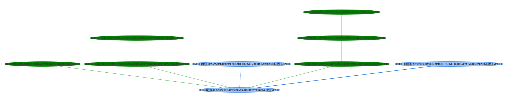

# software-forensic-kit

## Overview
Software-Forensic-Kit is a software tool kit to help identify quickly what's inside your binary files and is code reachable in your application. Often times, your binaries, including your open source libraries, will encapsulate other open source software. This makes it difficult to determine if a particular function in a certain library is being used by an application on your system.  This tool kit will help you find plausible paths to functions of interest by searching through your already built binaries and generating filtered callgraphs and by injecting into the target function and providing details when that function is invoked. 
 



### Prerequisites

* Requires Java 1.8+
* Requires Maven 3.x+

### Build & Run

1. Setup maven
2. Build Project
3. Run

### Setup maven
Requires Java 1.8+ and Maven 3.x+

1. Download maven from <https://maven.apache.org/download.cgi> and extract it.
2. Install JDK 8 and setup JAVA_HOME
3. Add maven bin directory to PATH 

### Build Project
Ensure java and maven are setup then run the following: 

```` bash
mvn initialize

mvn clean package
````
### Run

```
usage: Software_Forensic_Kit [-h] [-u <USERNAME>] [-p <PASSWORD>] [-d
       <DOMAIN>] [-f <FILTER>] [-s <FUNCTION>] [-cd <NUM>] [-rp <arg>]
       [-rd] [-jp] [-pp] [-g] [-gm] [-hi] [-hm] [-cgf] [-I] [-v] [-o
       <FOLDER>]
 -h,--help
 -u,--username <USERNAME>         Remote server username
 -p,--password <PASSWORD>         Remote server password
 -d,--domain <DOMAIN>             Remote server ip
 -f,--filter <FILTER>             Jar path must contain this term to be
                                  included
 -s,--searchFunction <FUNCTION>   Function to search for
 -cd,--depth <NUM>                Max callgraph depth (default is 8)
 -rp,--removePrefix <arg>         Remove Prefix from callgraph text
 -rd,--removeDuplicates           Remove Duplicate Paths
 -jp,--justPrint                  Print output to console
 -pp,--prettyPrint                Pretty Print output to console
 -g,--graphViz                    Output for Graphviz
 -gm,--graphVizM                  Output for Graphviz Multiple
 -hi,--html                       Output for HTML - https://visjs.org
 -hm,--htmlM                      Output for HTML Multiple -
                                  https://visjs.org
 -cgf,--callgraphFile             Passing in CallGraph file instead of
                                  jar(s)
 -I,--interactive                 Interactive Mode
 -v,--verbose                     Verbose
 -o,--output <FOLDER>             Output to folder
Example Usage:

>java -jar software_forensic_kit.jar -u root -d 10.160.157.187 -p test123 -s "ExampleClass:functionA" -f /var/www -hm -rp my.class.path.

Or using wildcards * for filter

>java -jar software_forensic_kit.jar -u root -d 10.160.157.187 -p test123 -s "ExampleClass*functionA" -f /var/www -pp -rp my.class.path. -o
C:\test\output

   If you want to run software forensic kit locally simply exclude (user, domain and password variables)

   >java -jar software_forensic_kit.jar -s "ExampleClass:functionA" -f C:\test -pp

For Interactive Mode:
   >java -jar software_forensic_kit.jar -I

```

## Contributing

The software-forensic-kit project team welcomes contributions from the community. Before you start working with software-forensic-kit, please read our [Developer Certificate of Origin](https://cla.vmware.com/dco). All contributions to this repository must be signed as described on that page. Your signature certifies that you wrote the patch or have the right to pass it on as an open-source patch. For more detailed information, refer to [CONTRIBUTING.md](CONTRIBUTING.md).

Be sure to end all commits with Signed-off-by: <username> <email>

## License
software-forensic-kit is available under the BSD-2 License.
For more detailed information, refer to [LICENSE.txt](LICENSE.txt).
